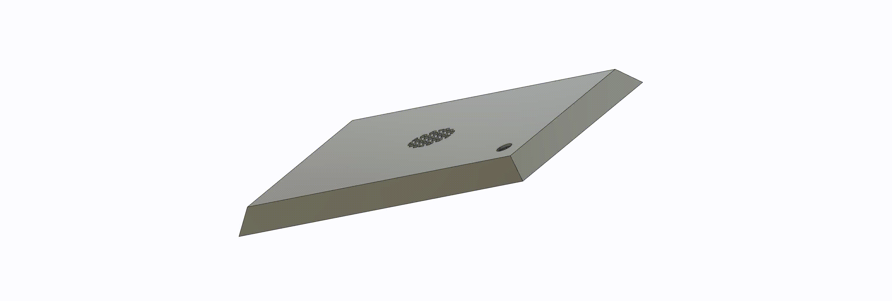
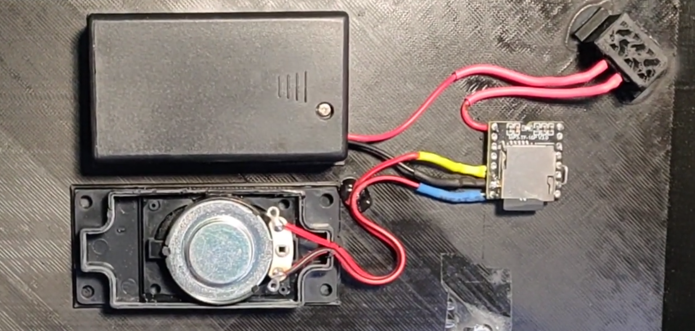
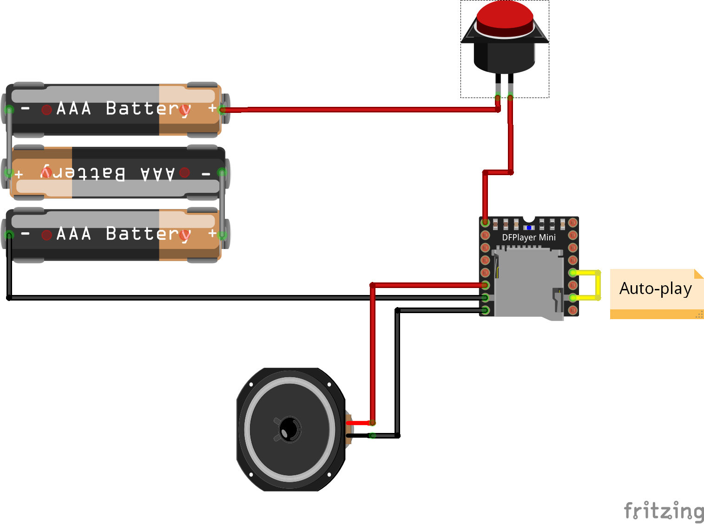

# Miniatures stand sound

Stand for miniatures with sound.

## 3D model

## Electronic

### Components

The system contains 4 components :

- DFPlayer Mini with sd card
- Speaker 3 Watt 8 Ohm
- Button
- Battery support x3 AAA 4,5 V

